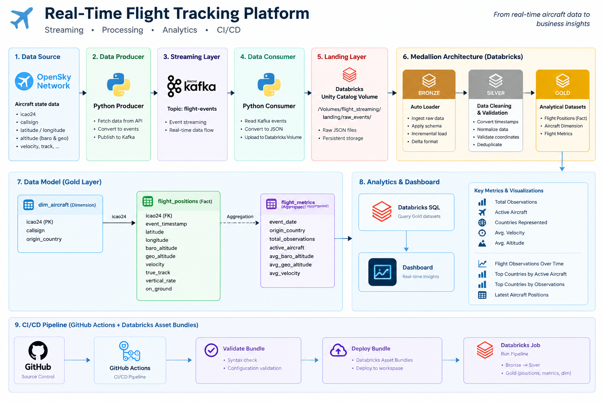
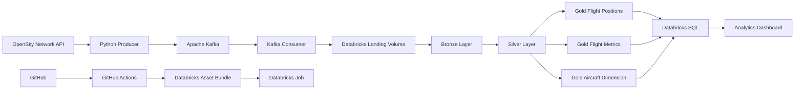

# ✈️ Real-Time Flight Tracking Platform

A cloud-based real-time flight tracking data platform built with **Apache Kafka, Databricks, Delta Lake, Unity Catalog, and GitHub Actions**.

The platform ingests aircraft position events, processes them through a **Medallion Architecture (Bronze → Silver → Gold)**, models the data for analytics, and exposes business-ready datasets through Databricks SQL.

---

## 🏗️ Architecture





---

## 🎯 Project Overview

This project demonstrates how to build a modern **real-time data engineering pipeline** for aircraft tracking.

Aircraft state information is collected from the **OpenSky Network API**, published as events through Kafka, transferred to Databricks, and processed using Spark Structured Streaming.

The data follows a Medallion Architecture:

```text
Raw Events
    ↓
Bronze
    ↓
Silver
    ↓
Gold
    ↓
Analytics
```

The Gold layer provides analytical datasets used to build a Databricks SQL dashboard.

---

## 🔄 Data Pipeline

### 1. Data Source

Aircraft tracking data is retrieved from the OpenSky Network API.

The source provides information such as:

* Aircraft identifier (`icao24`)
* Callsign
* Origin country
* Latitude
* Longitude
* Barometric altitude
* Geometric altitude
* Velocity
* Track
* Vertical rate
* Ground status
* Event timestamps

---

### 2. Apache Kafka

A Python producer converts aircraft state information into events and publishes them to Kafka.

Kafka topic:

```text
flight-events
```

Kafka acts as the event streaming layer between the data source and the processing platform.

---

### 3. Landing Layer

The Kafka consumer receives events and uploads JSON batches to a Databricks Unity Catalog Volume:

```text
/Volumes/flight_streaming/landing/raw_events/
```

This provides a persistent landing area before Spark processing.

---

# 🥉 Bronze Layer

The Bronze layer ingests the raw JSON events using **Databricks Auto Loader**.

Source:

```text
/Volumes/flight_streaming/landing/raw_events/
```

Target:

```text
flight_streaming.bronze.flight_events
```

### Bronze responsibilities

* Ingest raw events
* Apply an explicit schema
* Preserve source information
* Handle incremental file ingestion
* Store data as Delta

Streaming checkpoint:

```text
/Volumes/flight_streaming/bronze/checkpoints/flight_events
```

---

# 🥈 Silver Layer

The Silver layer cleans and validates the Bronze data.

Target:

```text
flight_streaming.silver.flight_events
```

### Transformations

* Convert Unix timestamps into timestamps
* Normalize callsigns
* Trim country names
* Validate latitude
* Validate longitude
* Remove records without `icao24`
* Deduplicate aircraft observations

### Silver grain

One row represents:

> **One aircraft observation at one event time.**

The logical observation key is:

```text
icao24 + event_time
```

---

# 🥇 Gold Layer

The Gold layer contains analytics-ready datasets.

## 1. Flight Positions Fact

Table:

```text
flight_streaming.gold.flight_positions
```

Grain:

> One aircraft observation at one event timestamp.

Main attributes:

```text
icao24
event_timestamp
latitude
longitude
baro_altitude
geo_altitude
velocity
true_track
vertical_rate
on_ground
```

This table represents the main flight-position fact dataset.

---

## 2. Aircraft Dimension

Table:

```text
flight_streaming.gold.dim_aircraft
```

Attributes:

```text
icao24
callsign
origin_country
```

The aircraft identifier:

```text
icao24
```

acts as the natural/business key for the aircraft dimension.

---

## 3. Flight Metrics

Table:

```text
flight_streaming.gold.flight_metrics
```

The table aggregates flight observations by:

```text
event_date
origin_country
```

Metrics include:

```text
total_observations
active_aircraft
avg_baro_altitude
avg_geo_altitude
avg_velocity
```

This dataset is designed for analytical reporting and dashboarding.

---

# ⭐ Data Model

The Gold layer follows a simplified analytical model:

```text
                    dim_aircraft
                         |
                         | icao24
                         |
                         ↓
                flight_positions
                    (Fact)
```

The metrics dataset is generated as an analytical aggregation from the Silver layer:

```text
Silver Flight Events
        |
        ↓
Flight Metrics
```

---

# 📊 Analytics & Dashboard

The Gold datasets are exposed through **Databricks SQL**.

The dashboard provides:

### KPI Cards

* Total Observations
* Active Aircraft
* Countries Represented
* Average Velocity
* Average Altitude

### Visualizations

* Flight Observations Over Time
* Top Countries by Active Aircraft
* Top Countries by Flight Observations
* Latest Aircraft Positions

Example dashboard structure:

```text
┌─────────────────────────────────────────────────────────────┐
│              REAL-TIME FLIGHT TRACKING                      │
│                       ANALYTICS                             │
├────────────┬────────────┬────────────┬────────────┬─────────┤
│ Observations│ Aircraft  │ Countries  │ Avg Speed  │ Avg Alt │
├────────────┴────────────┴────────────┴────────────┴─────────┤
│                                                             │
│              Flight Observations Over Time                 │
│                         LINE                                │
│                                                             │
├──────────────────────────────┬──────────────────────────────┤
│ Top Countries by Aircraft    │ Top Countries by            │
│                              │ Observations                │
│            BAR               │             BAR              │
├──────────────────────────────┴──────────────────────────────┤
│                 Latest Aircraft Positions                   │
│                         TABLE                               │
└─────────────────────────────────────────────────────────────┘
```

---

# 🚀 Databricks Processing

The project uses **Databricks Structured Streaming** and **Delta Lake**.

Because the project runs on Databricks Free Edition / serverless compute, streaming workloads use:

```python
.trigger(availableNow=True)
```

This allows the pipeline to process available data incrementally without relying on a continuously running streaming cluster.

---

# ⚙️ Databricks Job

The pipeline is orchestrated using a **Databricks Asset Bundle**.

The job dependency graph is:

```text
Bronze
  ↓
Silver
  ├───────────────┐
  ↓               ↓
Gold Positions   Gold Metrics
  │
  └───────┐
          ↓
     Dim Aircraft
```

The Databricks Job contains the following tasks:

```text
bronze
silver
gold_positions
gold_metrics
dim_aircraft
```

---

# 🔁 CI/CD

The project uses **GitHub Actions** for CI/CD.

Pipeline:

```text
Git Push / Pull Request
        ↓
GitHub Actions
        ↓
Validate Databricks Bundle
        ↓
Deploy to Databricks
```

The deployment is defined as code using:

```text
Databricks Asset Bundles
```

GitHub Secrets are used for authentication:

```text
DATABRICKS_HOST
DATABRICKS_TOKEN
```

Credentials are never stored in the repository.

---

# 📁 Project Structure

```text
real-time-flight-tracking-platform/
│
├── databricks/
│   │
│   ├── bronze/
│   │   └── 01_bronze_flight_streaming.py
│   │
│   ├── silver/
│   │   └── 02_silver_flight_events.py
│   │
│   ├── gold/
│   │   ├── 03_gold_flight_positions.py
│   │   ├── 04_gold_flight_metrics.py
│   │   └── 05_gold_dim_aircraft.py
│   │
│   ├── quality/
│   │   └── 06_data_quality_checks.py
│   │
│   └── resources/
│       └── flight_pipeline.yml
│
├── .github/
│   └── workflows/
│       └── databricks-ci-cd.yml
│
├── config.py
├── databricks.yml
├── .gitignore
├── producer/
├── consumer/
└── README.md
```

---

# 🛠️ Technologies

| Technology               | Purpose                             |
| ------------------------ | ----------------------------------- |
| Python                   | Data ingestion and event production |
| Apache Kafka             | Event streaming                     |
| OpenSky Network API      | Aircraft data source                |
| Databricks               | Data engineering platform           |
| Apache Spark             | Distributed processing              |
| Structured Streaming     | Streaming data processing           |
| Auto Loader              | Incremental file ingestion          |
| Delta Lake               | Reliable data storage               |
| Unity Catalog            | Data governance                     |
| Databricks SQL           | Analytics                           |
| GitHub                   | Source control                      |
| GitHub Actions           | CI/CD                               |
| Databricks Asset Bundles | Infrastructure / deployment as code |
| Docker                   | Local Kafka environment             |

---

# ▶️ How to Run the Project

## Prerequisites

Install:

* Python 3.x
* Docker Desktop
* Git
* Databricks CLI

You also need:

* A Databricks workspace
* Unity Catalog
* A Databricks authentication token
* GitHub repository secrets for CI/CD

---

## 1. Clone the repository

```bash
git clone https://github.com/NouriRD/real-time-flight-tracking-platform.git

cd real-time-flight-tracking-platform
```

---

## 2. Create a Python virtual environment

Windows:

```powershell
python -m venv .venv
```

Activate it:

```powershell
.venv\Scripts\activate
```

---

## 3. Install dependencies

```bash
pip install -r requirements.txt
```

---

## 4. Configure environment variables

Create a local `.env` file:

```text
DATABRICKS_HOST=<your-databricks-workspace-url>
DATABRICKS_TOKEN=<your-databricks-token>
```

Do not commit `.env`.

It is already excluded through `.gitignore`.

---

# 🐳 Start Kafka

Start the local Kafka environment using Docker Compose:

```bash
docker compose up -d
```

Verify the Kafka container:

```bash
docker ps
```

The Kafka topic used by the project is:

```text
flight-events
```

---

# 📡 Start the Producer

Run the Python producer to retrieve aircraft data and publish events:

```bash
python producer/producer.py
```

The producer sends events to:

```text
flight-events
```

---

# 📥 Start the Consumer

Run the consumer:

```bash
python consumer/consumer.py
```

The consumer reads Kafka events and uploads JSON batches to:

```text
/Volumes/flight_streaming/landing/raw_events/
```

---

# ☁️ Deploy the Databricks Bundle

Configure Databricks authentication:

```powershell
$env:DATABRICKS_HOST="https://<your-workspace>"
$env:DATABRICKS_TOKEN="<your-token>"
```

Validate:

```bash
databricks bundle validate -t dev
```

Deploy:

```bash
databricks bundle deploy -t dev
```

---

# ▶️ Run the Databricks Pipeline

Run the pipeline:

```bash
databricks bundle run flight_tracking_pipeline -t dev
```

The pipeline processes:

```text
Bronze
  ↓
Silver
  ↓
Gold
```

---

# 🔐 Security

Sensitive credentials are intentionally excluded from Git.

The following files should never be committed:

```text
.env
*.pem
*.key
```

Authentication for GitHub Actions is handled through GitHub Secrets.

---

# 📈 Key Engineering Concepts Demonstrated

This project demonstrates practical experience with:

* Real-time data ingestion
* Event-driven architecture
* Apache Kafka
* Spark Structured Streaming
* Databricks
* Delta Lake
* Auto Loader
* Medallion Architecture
* Unity Catalog
* Data cleaning and validation
* Deduplication
* Data modeling
* Fact and Dimension tables
* Analytical aggregations
* Databricks SQL
* Databricks Asset Bundles
* CI/CD
* GitHub Actions
* Cloud data engineering

---

# 🎓 What This Project Demonstrates

The project simulates a real-world data engineering platform where continuously arriving aircraft events are transformed into reliable, analytics-ready datasets.

It demonstrates the complete lifecycle:

```text
Ingestion
    ↓
Streaming
    ↓
Storage
    ↓
Transformation
    ↓
Data Modeling
    ↓
Analytics
    ↓
Dashboard
    ↓
CI/CD
```

---

# 👨‍💻 Author

**Noureddine RIDA**

Data Engineer | Databricks | Apache Spark | Kafka | Azure

GitHub:

https://github.com/NouriRD/real-time-flight-tracking-platform
